Usage
=====

.. _rectree:

Rectangular Tree
----------------

Let's draw a simple phylogenetic tree using the command below:

>>> from evotree.basicdraw import plottree
>>> TB,tree_object = plottree(tree="FigTree_newick")
>>> TB.basicdraw()
>>> TB.saveplot('Baisc_Tree.svg')

.. image:: Example_Data/Baisc_Tree.svg

Users can also write the above code into a ``*.py`` file and plot the tree using the command below:

.. code-block:: console

      (ENV)$ python Example_Code/basic_tree.py

.. note::

       All the example codes can be found in `Example_Code <https://github.com/heche-psb/evotree-docs/tree/main/docs/source/Example_Code>`_ and the example data in `Example_Data <https://github.com/heche-psb/evotree-docs/tree/main/docs/source/Example_Data>`_.

Now, let's add **uncertainty bands** to each internal nodes using the command below:

>>> from evotree.basicdraw import plottree
>>> TB,tree_object = plottree(tree="FigTree_newick")
>>> TB.plotnodeuncertainty = True
>>> TB.nulw = 3
>>> TB.nuccolor = 'gray'
>>> TB.basicdraw()
>>> TB.saveplot('With_Uncertainty.svg')

Or using the command below:

.. code-block:: console

      (ENV)$ python Example_Code/with_uncertainty.py

.. image:: Example_Data/With_Uncertainty.svg

We can also add the **fossil calibrations** that we used using the command below:

>>> from evotree.basicdraw import plottree
>>> TB,tree_object = plottree(tree="FigTree_newick")
>>> TB.plotnodeuncertainty = True
>>> TB.nulw = 3
>>> TB.nuccolor = 'gray'
>>> TB.basicdraw()
>>> fossilnodes=[('Prasinoderma_coloniale','Amborella_trichopoda'),('Ostreococcus_lucimarinus','Pedinomonas_minor'),('Pedinomonas_minor','Mesostigma_viride'),('Botryococcus_braunii','Volvox_carteri'),('Botryococcus_braunii','Coccomyxa_subellipsoidea'),('Spirogloea_muscicola','Amborella_trichopoda'),('Anthoceros_angustus','Amborella_trichopoda'),('Takakia_lepidozioides','Marchantia_polymorpha'),('Selaginella_moellendorffii','Amborella_trichopoda'),('Adiantum_capillus-veneris','Amborella_trichopoda'),('Cycas_panzhihuaensis','Amborella_trichopoda'),('Aristolochia_fimbriata','Amborella_trichopoda')]
>>> TB.highlightnode(nodes=fossilnodes,colors=['orange' for i in fossilnodes],nodesizes=[8 for i in fossilnodes],addlegend=True,legendlabel="Fossil calibrations")
>>> TB.saveplot('With_Fossil.svg')

Or using the command below:

.. code-block:: console

      (ENV)$ python Example_Code/with_fossil.py

.. image:: Example_Data/With_Fossil.svg

We can further **highlight specific clades** using the command below:

>>> from evotree.basicdraw import plottree
>>> TB,tree_object = plottree(tree="FigTree_newick")
>>> TB.plotnodeuncertainty = True
>>> TB.nulw = 3
>>> TB.nuccolor = 'gray'
>>> TB.basicdraw()
>>> fossilnodes=[('Prasinoderma_coloniale','Amborella_trichopoda'),('Ostreococcus_lucimarinus','Pedinomonas_minor'),('Pedinomonas_minor','Mesostigma_viride'),('Botryococcus_braunii','Volvox_carteri'),('Botryococcus_braunii','Coccomyxa_subellipsoidea'),('Spirogloea_muscicola','Amborella_trichopoda'),('Anthoceros_angustus','Amborella_trichopoda'),('Takakia_lepidozioides','Marchantia_polymorpha'),('Selaginella_moellendorffii','Amborella_trichopoda'),('Adiantum_capillus-veneris','Amborella_trichopoda'),('Cycas_panzhihuaensis','Amborella_trichopoda'),('Aristolochia_fimbriata','Amborella_trichopoda')]
>>> TB.highlightnode(nodes=fossilnodes,colors=['orange' for i in fossilnodes],nodesizes=[8 for i in fossilnodes],addlegend=True,legendlabel="Fossil calibrations")
>>> TB.highlightclade(clades=[('Amborella_trichopoda','Anthoceros_angustus'),('Zygnema_circumcarinatum_SAG_698-1b','Mesostigma_viride')],facecolors=['red','green'],gradual=True,alphas=[0.6,0.3],rightoffset=0.01,topoffset=0.02,bottomoffset=-0.01,labels=['Embryophyta','Streptophyta'],labelboxcolors=['black','black'],labelcolors=['white','white'])
>>> TB.highlightclade(clades=[('Volvox_carteri','Pedinomonas_minor'),('Micromonas_pusilla','Ostreococcus_lucimarinus')],facecolors=['gray','black'],gradual=True,alphas=[0.3,0.3],rightoffset=0.01,topoffset=0.02,bottomoffset=-0.01,labels=['Chlorophytina','Prasinophytina'],labelboxcolors=['black','black'],labelcolors=['white','white'])
>>> TB.saveplot('Highlight_Clade.svg')

Or using the command below:

.. code-block:: console

      (ENV)$ python Example_Code/highlight_clade.py

.. image:: Example_Data/Highlight_Clade.svg

Adding a **time-scale** can be achieved using the command below:

>>> from evotree.basicdraw import plottree
>>> TB,tree_object = plottree(tree="FigTree_newick")
>>> TB.plotnodeuncertainty = True
>>> TB.nulw = 3
>>> TB.nuccolor = 'gray'
>>> TB.basicdraw()
>>> fossilnodes=[('Prasinoderma_coloniale','Amborella_trichopoda'),('Ostreococcus_lucimarinus','Pedinomonas_minor'),('Pedinomonas_minor','Mesostigma_viride'),('Botryococcus_braunii','Volvox_carteri'),('Botryococcus_braunii','Coccomyxa_subellipsoidea'),('Spirogloea_muscicola','Amborella_trichopoda'),('Anthoceros_angustus','Amborella_trichopoda'),('Takakia_lepidozioides','Marchantia_polymorpha'),('Selaginella_moellendorffii','Amborella_trichopoda'),('Adiantum_capillus-veneris','Amborella_trichopoda'),('Cycas_panzhihuaensis','Amborella_trichopoda'),('Aristolochia_fimbriata','Amborella_trichopoda')]
>>> TB.highlightnode(nodes=fossilnodes,colors=['orange' for i in fossilnodes],nodesizes=[8 for i in fossilnodes],addlegend=True,legendlabel="Fossil calibrations")
>>> TB.highlightclade(clades=[('Amborella_trichopoda','Anthoceros_angustus'),('Zygnema_circumcarinatum_SAG_698-1b','Mesostigma_viride')],facecolors=['red','green'],gradual=True,alphas=[0.6,0.3],rightoffset=0.01,topoffset=0.02,bottomoffset=-0.01,labels=['Embryophyta','Streptophyta'],labelboxcolors=['black','black'],labelcolors=['white','white'])
>>> TB.highlightclade(clades=[('Volvox_carteri','Pedinomonas_minor'),('Micromonas_pusilla','Ostreococcus_lucimarinus')],facecolors=['gray','black'],gradual=True,alphas=[0.3,0.3],rightoffset=0.01,topoffset=0.02,bottomoffset=-0.01,labels=['Chlorophytina','Prasinophytina'],labelboxcolors=['black','black'],labelcolors=['white','white'])
>>> TB.drawscale(plotfulllengthscale=True,fullscaletickheight=0.1,fullscaleticklabeloffset=0.1,addgeo=True,geoscaling=100,fullscalexticks=[int(i*100) for i in range(14)])
>>> TB.saveplot('Add_TimeScale.svg')

Or using the command below:

.. code-block:: console

      (ENV)$ python Example_Code/add_timescale.py

.. image:: Example_Data/Add_TimeScale.svg

Here we have inferred the WGD date of `Spirogloea muscicola`, we can **add this WGD** and **show legend** using the command below:

>>> from evotree.basicdraw import plottree
>>> TB,tree_object = plottree(tree="FigTree_newick")
>>> TB.plotnodeuncertainty = True
>>> TB.nulw = 3
>>> TB.nuccolor = 'gray'
>>> TB.basicdraw()
>>> fossilnodes=[('Prasinoderma_coloniale','Amborella_trichopoda'),('Ostreococcus_lucimarinus','Pedinomonas_minor'),('Pedinomonas_minor','Mesostigma_viride'),('Botryococcus_braunii','Volvox_carteri'),('Botryococcus_braunii','Coccomyxa_subellipsoidea'),('Spirogloea_muscicola','Amborella_trichopoda'),('Anthoceros_angustus','Amborella_trichopoda'),('Takakia_lepidozioides','Marchantia_polymorpha'),('Selaginella_moellendorffii','Amborella_trichopoda'),('Adiantum_capillus-veneris','Amborella_trichopoda'),('Cycas_panzhihuaensis','Amborella_trichopoda'),('Aristolochia_fimbriata','Amborella_trichopoda')]
>>> TB.highlightnode(nodes=fossilnodes,colors=['orange' for i in fossilnodes],nodesizes=[8 for i in fossilnodes],addlegend=True,legendlabel="Fossil calibrations")
>>> TB.highlightclade(clades=[('Amborella_trichopoda','Anthoceros_angustus'),('Zygnema_circumcarinatum_SAG_698-1b','Mesostigma_viride')],facecolors=['red','green'],gradual=True,alphas=[0.6,0.3],rightoffset=0.01,topoffset=0.02,bottomoffset=-0.01,labels=['Embryophyta','Streptophyta'],labelboxcolors=['black','black'],labelcolors=['white','white'])
>>> TB.highlightclade(clades=[('Volvox_carteri','Pedinomonas_minor'),('Micromonas_pusilla','Ostreococcus_lucimarinus')],facecolors=['gray','black'],gradual=True,alphas=[0.3,0.3],rightoffset=0.01,topoffset=0.02,bottomoffset=-0.01,labels=['Chlorophytina','Prasinophytina'],labelboxcolors=['black','black'],labelcolors=['white','white'])
>>> TB.drawscale(plotfulllengthscale=True,fullscaletickheight=0.1,fullscaleticklabeloffset=0.1,addgeo=True,geoscaling=100,fullscalexticks=[int(i*100) for i in range(14)])
>>> TB.drawwgd(wgd="Spi_WGD.tsv",addlegend=True,legendlabel="Newly dated ancient polyploidy event",lw=8,al=0.8)
>>> TB.showlegend(frameon=False,bbox_to_anchor=(0.60, 0.95))
>>> TB.saveplot('Add_WGD.svg')

Or using the command below:

.. code-block:: console

      (ENV)$ python Example_Code/add_wgd.py

.. image:: Example_Data/Add_WGD.svg

Now let's **add habitat type** data to the tree using the command below:

>>> from evotree.basicdraw import plottree
>>> from matplotlib.pyplot import cm
>>> import numpy as np
>>> TB,tree_object = plottree(tree="FigTree_newick")
>>> TB.fs =(12,14)
>>> TB.plotnodeuncertainty = True
>>> TB.nulw = 3
>>> TB.nuccolor = 'gray'
>>> TB.basicdraw()
>>> fossilnodes=[('Prasinoderma_coloniale','Amborella_trichopoda'),('Ostreococcus_lucimarinus','Pedinomonas_minor'),('Pedinomonas_minor','Mesostigma_viride'),('Botryococcus_braunii','Volvox_carteri'),('Botryococcus_braunii','Coccomyxa_subellipsoidea'),('Spirogloea_muscicola','Amborella_trichopoda'),('Anthoceros_angustus','Amborella_trichopoda'),('Takakia_lepidozioides','Marchantia_polymorpha'),('Selaginella_moellendorffii','Amborella_trichopoda'),('Adiantum_capillus-veneris','Amborella_trichopoda'),('Cycas_panzhihuaensis','Amborella_trichopoda'),('Aristolochia_fimbriata','Amborella_trichopoda')]
>>> TB.highlightnode(nodes=fossilnodes,colors=['orange' for i in fossilnodes],nodesizes=[8 for i in fossilnodes],addlegend=True,legendlabel="Fossil calibrations")
>>> TB.highlightclade(clades=[('Amborella_trichopoda','Anthoceros_angustus'),('Zygnema_circumcarinatum_SAG_698-1b','Mesostigma_viride')],facecolors=['red','green'],gradual=True,alphas=[0.6,0.3],rightoffset=0.01,topoffset=0.02,bottomoffset=-0.01,labels=['Embryophyta','Streptophyta'],labelboxcolors=['black','black'],labelcolors=['white','white'])
>>> TB.highlightclade(clades=[('Volvox_carteri','Pedinomonas_minor'),('Micromonas_pusilla','Ostreococcus_lucimarinus')],facecolors=['gray','black'],gradual=True,alphas=[0.3,0.3],rightoffset=0.01,topoffset=0.02,bottomoffset=-0.01,labels=['Chlorophytina','Prasinophytina'],labelboxcolors=['black','black'],labelcolors=['white','white'])
>>> TB.drawscale(plotfulllengthscale=True,fullscaletickheight=0.1,fullscaleticklabeloffset=0.1,addgeo=True,geoscaling=100,fullscalexticks=[int(i*100) for i in range(14)])
>>> TB.drawwgd(wgd="Spi_WGD.tsv",addlegend=True,legendlabel="Newly dated ancient polyploidy event",lw=8,al=0.8)
>>> inixoffset = 0.60
>>> colors = cm.viridis(np.linspace(0, 1, 7))
>>> colormap = {i:colors[i] for i in range(7)}
>>> Map_Habitat = {0:"Terrestrial",1:"Subaerial",2:"Freshwater",3:"Marine",4:"Terrestrial/Subaerial",5:"Subaerial/Freshwater",6:"Hypersaline"}
>>> TB.drawcircles(traittype="Habitat.tsv",xoffset=inixoffset,usetypedata=["Habitat"],traitobjectname="Habitat",scalingx=0.1,maxcirclesize=24,colormap=colormap,legendmap=Map_Habitat)
>>> TB.showlegend(frameon=False,bbox_to_anchor=(0.40, 0.65),labelspacing=2.3)
>>> TB.saveplot('Add_Habitat.svg')

Or using the command below:

.. code-block:: console

      (ENV)$ python Example_Code/add_habitat.py

.. image:: Example_Data/Add_Habitat.svg

We can plot **gene duplication** data to the tree while **specify the order of legends** using the command below:

>>> from evotree.basicdraw import plottree
>>> from matplotlib.pyplot import cm
>>> import numpy as np
>>> TB,tree_object = plottree(tree="FigTree_newick")
>>> TB.fs = (16,13)
>>> TB.plotnodeuncertainty = True
>>> TB.nulw = 3
>>> TB.nuccolor = 'gray'
>>> TB.basicdraw()
>>> fossilnodes=[('Prasinoderma_coloniale','Amborella_trichopoda'),('Ostreococcus_lucimarinus','Pedinomonas_minor'),('Pedinomonas_minor','Mesostigma_viride'),('Botryococcus_braunii','Volvox_carteri'),('Botryococcus_braunii','Coccomyxa_subellipsoidea'),('Spirogloea_muscicola','Amborella_trichopoda'),('Anthoceros_angustus','Amborella_trichopoda'),('Takakia_lepidozioides','Marchantia_polymorpha'),('Selaginella_moellendorffii','Amborella_trichopoda'),('Adiantum_capillus-veneris','Amborella_trichopoda'),('Cycas_panzhihuaensis','Amborella_trichopoda'),('Aristolochia_fimbriata','Amborella_trichopoda')]
>>> TB.highlightnode(nodes=fossilnodes,colors=['orange' for i in fossilnodes],nodesizes=[8 for i in fossilnodes],addlegend=True,legendlabel="Fossil calibrations")
>>> TB.highlightclade(clades=[('Amborella_trichopoda','Anthoceros_angustus'),('Zygnema_circumcarinatum_SAG_698-1b','Mesostigma_viride')],facecolors=['red','green'],gradual=True,alphas=[0.6,0.3],rightoffset=0.01,topoffset=0.02,bottomoffset=-0.01,labels=['Embryophyta','Streptophyta'],labelboxcolors=['black','black'],labelcolors=['white','white'])
>>> TB.highlightclade(clades=[('Volvox_carteri','Pedinomonas_minor'),('Micromonas_pusilla','Ostreococcus_lucimarinus')],facecolors=['gray','black'],gradual=True,alphas=[0.3,0.3],rightoffset=0.01,topoffset=0.02,bottomoffset=-0.01,labels=['Chlorophytina','Prasinophytina'],labelboxcolors=['black','black'],labelcolors=['white','white'])
>>> TB.drawscale(plotfulllengthscale=True,fullscaletickheight=0.1,fullscaleticklabeloffset=0.1,addgeo=True,geoscaling=100,fullscalexticks=[int(i*100) for i in range(14)])
>>> TB.drawwgd(wgd="Spi_WGD.tsv",addlegend=True,legendlabel="Newly dated ancient polyploidy event",lw=8,al=0.8)
>>> inixoffset = 0.60
>>> colors = cm.viridis(np.linspace(0, 1, 7))
>>> colormap = {i:colors[i] for i in range(7)}
>>> Map_Habitat = {0:"Terrestrial",1:"Subaerial",2:"Freshwater",3:"Marine",4:"Terrestrial/Subaerial",5:"Subaerial/Freshwater",6:"Hypersaline"}
>>> TB.drawcircles(traittype="Habitat.tsv",xoffset=inixoffset,usetypedata=["Habitat"],traitobjectname="Habitat",scalingx=0.1,maxcirclesize=24,colormap=colormap,legendmap=Map_Habitat)
>>> stepxoffset = 0.15
>>> cols = ["WGD-pairs-percentage","TD-pairs-percentage","PD-pairs-percentage","TRD-pairs-percentage","DSD-pairs-percentage"]
>>> for ind,col in enumerate(cols):
>>>     quantitylegendflag = True if ind == 0 else False
>>>     TB.drawcircles(traitquantity='dupfinder.info.percentage.tsv',usequantitydata=[col],xoffset=inixoffset+stepxoffset*(ind+1),traitobjectname="{}".format(col.replace("-percentage","")),scalingx=0.2,maxcirclesize=24,quantitylegend=quantitylegendflag,maxvaluescaler=1,decimal=2)
>>> handles, labels = TB.ax.get_legend_handles_labels()
>>> order_dic = {'Terrestrial':1,'Terrestrial/Subaerial':2,'Subaerial':3,'Subaerial/Freshwater':4,'Freshwater':5,'Marine':6,'Hypersaline':7}
>>> labels, handles = zip(r*sorted(zip(labels, handles), key=lambda x: order_dic.get(x[0],0)))
>>> TB.showlegend(handles,labels,frameon=False,bbox_to_anchor=(0.25, 0.45),labelspacing=2.3)
>>> TB.saveplot('Add_GD.svg')

Or using the command below:

.. code-block:: console

      (ENV)$ python Example_Code/add_gd.py

.. image:: Example_Data/Add_GD.svg

We can also show the gene duplication data as **bar plots** using the command below:

>>> from evotree.basicdraw import plottree
>>> from matplotlib.pyplot import cm
>>> import numpy as np
>>> TB,tree_object = plottree(tree="FigTree_newick")
>>> TB.fs = (18,13)
>>> TB.plotnodeuncertainty = True
>>> TB.nulw = 3
>>> TB.nuccolor = 'gray'
>>> TB.basicdraw()
>>> fossilnodes=[('Prasinoderma_coloniale','Amborella_trichopoda'),('Ostreococcus_lucimarinus','Pedinomonas_minor'),('Pedinomonas_minor','Mesostigma_viride'),('Botryococcus_braunii','Volvox_carteri'),('Botryococcus_braunii','Coccomyxa_subellipsoidea'),('Spirogloea_muscicola','Amborella_trichopoda'),('Anthoceros_angustus','Amborella_trichopoda'),('Takakia_lepidozioides','Marchantia_polymorpha'),('Selaginella_moellendorffii','Amborella_trichopoda'),('Adiantum_capillus-veneris','Amborella_trichopoda'),('Cycas_panzhihuaensis','Amborella_trichopoda'),('Aristolochia_fimbriata','Amborella_trichopoda')]
>>> TB.highlightnode(nodes=fossilnodes,colors=['orange' for i in fossilnodes],nodesizes=[8 for i in fossilnodes],addlegend=True,legendlabel="Fossil calibrations")
>>> TB.highlightclade(clades=[('Amborella_trichopoda','Anthoceros_angustus'),('Zygnema_circumcarinatum_SAG_698-1b','Mesostigma_viride')],facecolors=['red','green'],gradual=True,alphas=[0.6,0.3],rightoffset=0.01,topoffset=0.02,bottomoffset=-0.01,labels=['Embryophyta','Streptophyta'],labelboxcolors=['black','black'],labelcolors=['white','white'])
>>> TB.highlightclade(clades=[('Volvox_carteri','Pedinomonas_minor'),('Micromonas_pusilla','Ostreococcus_lucimarinus')],facecolors=['gray','black'],gradual=True,alphas=[0.3,0.3],rightoffset=0.01,topoffset=0.02,bottomoffset=-0.01,labels=['Chlorophytina','Prasinophytina'],labelboxcolors=['black','black'],labelcolors=['white','white'])
>>> TB.drawscale(plotfulllengthscale=True,fullscaletickheight=0.1,fullscaleticklabeloffset=0.1,addgeo=True,geoscaling=100,fullscalexticks=[int(i*100) for i in range(14)])
>>> TB.drawwgd(wgd="Spi_WGD.tsv",addlegend=True,legendlabel="Newly dated ancient polyploidy event",lw=8,al=0.8)
>>> inixoffset = 0.65
>>> colors = cm.viridis(np.linspace(0, 1, 7))
>>> colormap = {i:colors[i] for i in range(7)}
>>> Map_Habitat = {0:"Terrestrial",1:"Subaerial",2:"Freshwater",3:"Marine",4:"Terrestrial/Subaerial",5:"Subaerial/Freshwater",6:"Hypersaline"}
>>> TB.drawcircles(traittype="Habitat.tsv",xoffset=inixoffset,usetypedata=["Habitat"],traitobjectname="Habitat",scalingx=0.1,maxcirclesize=24,colormap=colormap,legendmap=Map_Habitat)
>>> stepxoffset = 0.25
>>> cols = ["WGD-pairs-percentage","TD-pairs-percentage","PD-pairs-percentage","TRD-pairs-percentage","DSD-pairs-percentage"]
>>> for ind,col in enumerate(cols):
>>>     TB.drawtrait(trait=["dupfinder.info.percentage.tsv"],usedata=[col],xoffset=inixoffset+stepxoffset*(ind+1),traitobjectname="{}".format(col.replace("-percentage","")),scalingx=0.2,traitcolor='gray',decimal=2)
>>> handles, labels = TB.ax.get_legend_handles_labels()
>>> order_dic = {'Terrestrial':1,'Terrestrial/Subaerial':2,'Subaerial':3,'Subaerial/Freshwater':4,'Freshwater':5,'Marine':6,'Hypersaline':7}
>>> labels, handles = zip(r*sorted(zip(labels, handles), key=lambda x: order_dic.get(x[0],0)))
>>> TB.showlegend(handles,labels,frameon=False,bbox_to_anchor=(0.25, 0.60),labelspacing=2.3)
>>> TB.saveplot('GD_Bar.svg')

Or using the command below:

.. code-block:: console

      (ENV)$ python Example_Code/gd_bar.py

.. image:: Example_Data/GD_Bar.svg

.. _polartree:

Polar Tree
----------

We can draw all the above rectangular trees in a polar coordinate system. To draw a simple polar tree, we can use the code below.

>>> from evotree.basicdraw import plottree
>>> TB,tree_object = plottree(tree="FigTree_newick")
>>> TB.polardraw()
>>> TB.saveplot('Baisc_Tree_Polar.svg')

Or using the command below:

.. code-block:: console

      (ENV)$ python Example_Code/basic_tree_polar.py

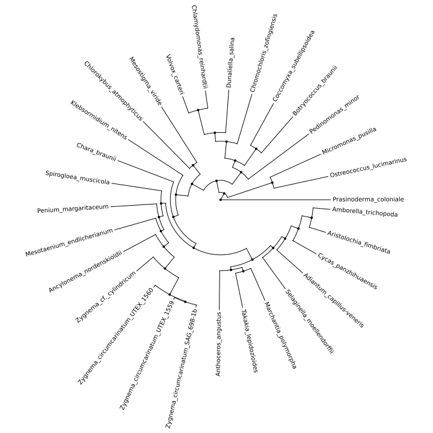

We can change different spanning angles by setting the ``polar`` parameter. Below we set the ``polar`` as 60,120,180,270,330,355 in a single graph.

>>> from evotree.basicdraw import plottree
>>> import matplotlib.pyplot as plt
>>> fig, axes = plt.subplots(2,3,figsize=(24, 16),subplot_kw={'projection': 'polar'})
>>> angles = [60,120,180,270,330,355]
>>> for angle,ax in zip(angles,axes.flatten()):
>>>     TB,tree_object = plottree(tree="FigTree_newick",userfig=fig,userax=ax)
>>>     TB.polardraw(polar=angle)
>>> TB.saveplot('Baisc_Tree_Polar_Angles.svg')

Or using the command below:

.. code-block:: console

      (ENV)$ python Example_Code/basic_tree_polar_angles.py

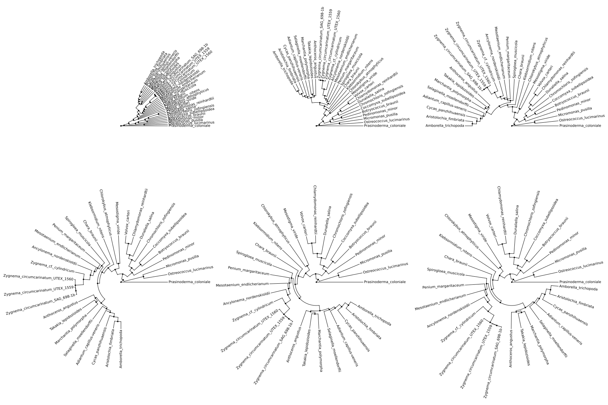

.. note::

       The ``axes`` object must be created with a polar projection. We didn't set 360 degree because conceivably that will lead the top and bottom branch to overlap.

We can also start from different angles (default is 0) by setting the ``start`` parameter. Below we set the ``start`` as 30,60,90,120,150,180 in a single graph with 180 degree span.

>>> from evotree.basicdraw import plottree
>>> import matplotlib.pyplot as plt
>>> fig, axes = plt.subplots(2,3,figsize=(24, 16),subplot_kw={'projection': 'polar'})
>>> start_angles = [30,60,90,120,150,180]
>>> for angle,ax in zip(start_angles,axes.flatten()):
>>>     TB,tree_object = plottree(tree="FigTree_newick",userfig=fig,userax=ax)
>>>     TB.polardraw(polar=angle+180,start=angle)
>>> TB.saveplot('Baisc_Tree_Polar_Start_Angles.svg')

Or using the command below:

.. code-block:: console

      (ENV)$ python Example_Code/basic_tree_polar_start_angles.py

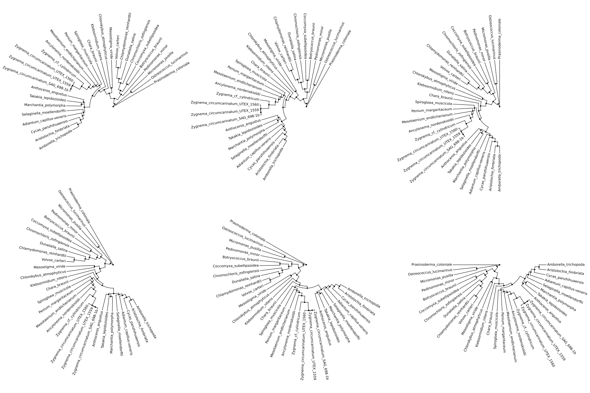

We can also add **uncertainty bands** to each internal nodes using the command below.

>>> from evotree.basicdraw import plottree
>>> TB,tree_object = plottree(tree="FigTree_newick")
>>> TB.plotnodeuncertainty = True
>>> TB.nulw = 3
>>> TB.nuccolor = 'gray'
>>> TB.polardraw()
>>> TB.saveplot('Baisc_Tree_Polar_With_Uncertainty.svg')

Or using the command below:

.. code-block:: console

      (ENV)$ python Example_Code/basic_tree_polar_with_uncertainty.py

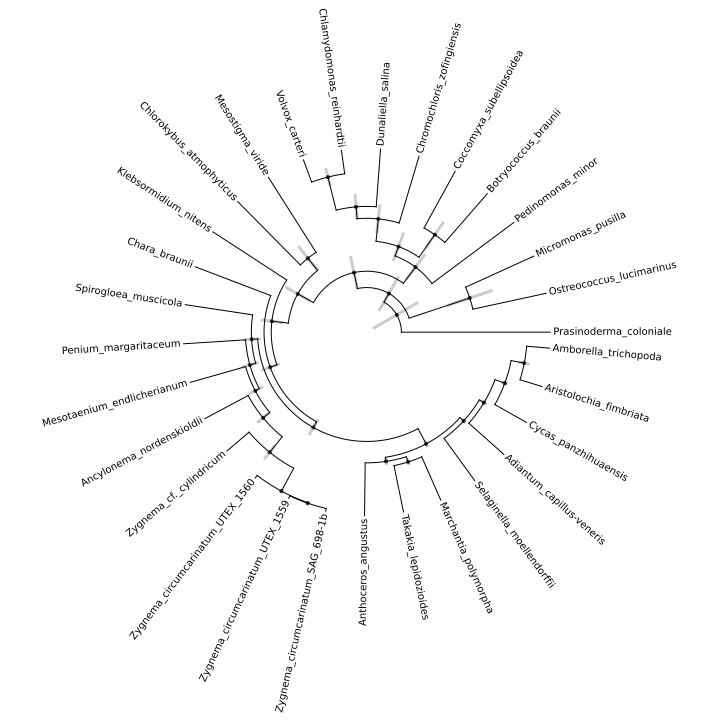

**Fossil calibrations** can be added using the command below.

>>> from evotree.basicdraw import plottree
>>> TB,tree_object = plottree(tree="FigTree_newick")
>>> TB.plotnodeuncertainty = True
>>> TB.nulw = 3
>>> TB.nuccolor = 'gray'
>>> TB.polardraw()
>>> fossilnodes=[('Prasinoderma_coloniale','Amborella_trichopoda'),('Ostreococcus_lucimarinus','Pedinomonas_minor'),('Pedinomonas_minor','Mesostigma_viride'),('Botryococcus_braunii','Volvox_carteri'),('Botryococcus_braunii','Coccomyxa_subellipsoidea'),('Spirogloea_muscicola','Amborella_trichopoda'),('Anthoceros_angustus','Amborella_trichopoda'),('Takakia_lepidozioides','Marchantia_polymorpha'),('Selaginella_moellendorffii','Amborella_trichopoda'),('Adiantum_capillus-veneris','Amborella_trichopoda'),('Cycas_panzhihuaensis','Amborella_trichopoda'),('Aristolochia_fimbriata','Amborella_trichopoda')]
>>> TB.highlightnodepolar(nodes=fossilnodes,colors=['orange' for i in fossilnodes],nodesizes=[8 for i in fossilnodes],addlegend=True,legendlabel="Fossil calibrations")
>>> TB.saveplot('Baisc_Tree_Polar_With_Fossil.svg')

Or using the command below:

.. code-block:: console

      (ENV)$ python Example_Code/basic_tree_polar_with_fossil.py

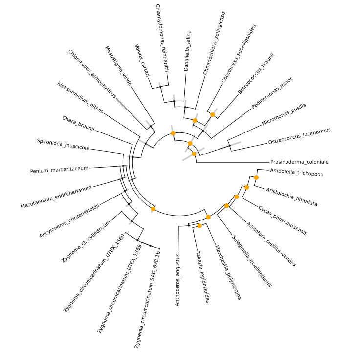

We can further **highlight specific clades** using the command below:

>>> from evotree.basicdraw import plottree
>>> TB,tree_object = plottree(tree="FigTree_newick")
>>> TB.plotnodeuncertainty = True
>>> TB.nulw = 3
>>> TB.nuccolor = 'gray'
>>> TB.polardraw()
>>> fossilnodes=[('Prasinoderma_coloniale','Amborella_trichopoda'),('Ostreococcus_lucimarinus','Pedinomonas_minor'),('Pedinomonas_minor','Mesostigma_viride'),('Botryococcus_braunii','Volvox_carteri'),('Botryococcus_braunii','Coccomyxa_subellipsoidea'),('Spirogloea_muscicola','Amborella_trichopoda'),('Anthoceros_angustus','Amborella_trichopoda'),('Takakia_lepidozioides','Marchantia_polymorpha'),('Selaginella_moellendorffii','Amborella_trichopoda'),('Adiantum_capillus-veneris','Amborella_trichopoda'),('Cycas_panzhihuaensis','Amborella_trichopoda'),('Aristolochia_fimbriata','Amborella_trichopoda')]
>>> TB.highlightnodepolar(nodes=fossilnodes,colors=['orange' for i in fossilnodes],nodesizes=[8 for i in fossilnodes],addlegend=True,legendlabel="Fossil calibrations")
>>> TB.highlightcladepolar(clades=[('Amborella_trichopoda','Anthoceros_angustus'),('Zygnema_circumcarinatum_SAG_698-1b','Mesostigma_viride')],facecolors=['red','green'],gradual=False,alphas=[0.6,0.3],rightoffset=0,topoffset=0,bottomoffset=0,labels=['Embryophyta','Streptophyta'],labelboxcolors=['black','black'],labelcolors=['white','white'],saturations=[0.8]*2,labelpositions=['bottom','bottom'])
>>> TB.highlightcladepolar(clades=[('Volvox_carteri','Pedinomonas_minor'),('Micromonas_pusilla','Ostreococcus_lucimarinus')],facecolors=['gray','black'],gradual=False,alphas=[0.3,0.3],rightoffset=0,topoffset=0,bottomoffset=0,labels=['Chlorophytina','Prasinophytina'],labelboxcolors=['black','black'],labelcolors=['white','white'],saturations=[0.8]*2,labelpositions=['bottom','bottom'])
>>> TB.saveplot('Baisc_Tree_Polar_Highlight_Clade.svg')

Or using the command below:

.. code-block:: console

      (ENV)$ python Example_Code/basic_tree_polar_highlight_clade.py

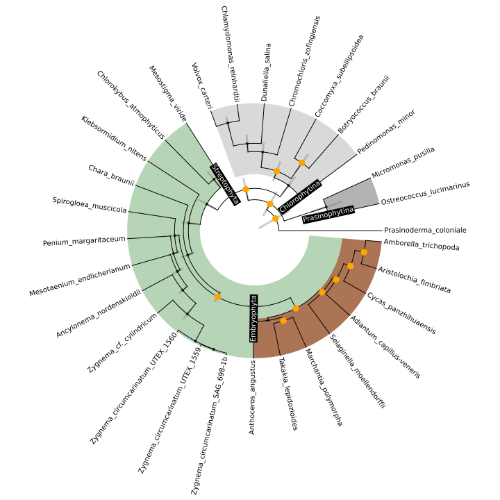

Besides rectangular and ultrametric tree, we can also draw polar and non-ultrametric tree. Here we use a species tree of 243 land plants (unpublished data) and code below.

>>> from evotree.basicdraw import plottree
>>> from matplotlib.pyplot import cm
>>> import numpy as np
>>> from Bio import Phylo
>>> Tree = Phylo.read("Example_243.tree",'newick')
>>> for tip in Tree.get_terminals():
>>>     if tip.name.endswith(".cds"):
>>>             tip.name = tip.name[:-4]
>>> TB,tree_object = plottree(treeobject=Tree)
>>> TB.fs =(24,24)
>>> TB.polardraw()
>>> colors = cm.viridis(np.linspace(0, 1, 7))
>>> TB.highlightcladepolar(clades=[('Amborella-trichopoda','Malus-doumeri'),('Gnetum-montanum','Taxus-wallichiana'),('Dipteris-shenzhenensis','Azolla-filiculoides'),('Huperzia-asiatica','Selaginella-moellendorffii'),('Leiosporoceros-dussii','Phaeoceros-laevis_902'),('Haplomitrium-mnioides','Herbertus-kurzii'),('Takakia-lepidozioides','Brachythecium-laetum')],facecolors=colors,alphas=[0.5]*7,rightoffset=0,topoffset=0,bottomoffset=0,labels=['Angiosperm','Gymnosperm','Fern','Lycophyte','Hornwort','Liverwort','Moss'],labelboxcolors=['black']*7,labelcolors=['white']*7,gradual=False,convexhull=True,saturations=[0.8]*7,convexsmoothness=1000,convexalpha=None)
>>> TB.showlegend(frameon=False,fontsize=35)
>>> TB.saveplot('POLAR_NONULTRA.svg')

Or using the command below.

.. code-block:: console

      (ENV)$ python Example_Code/polar_nonultra.py

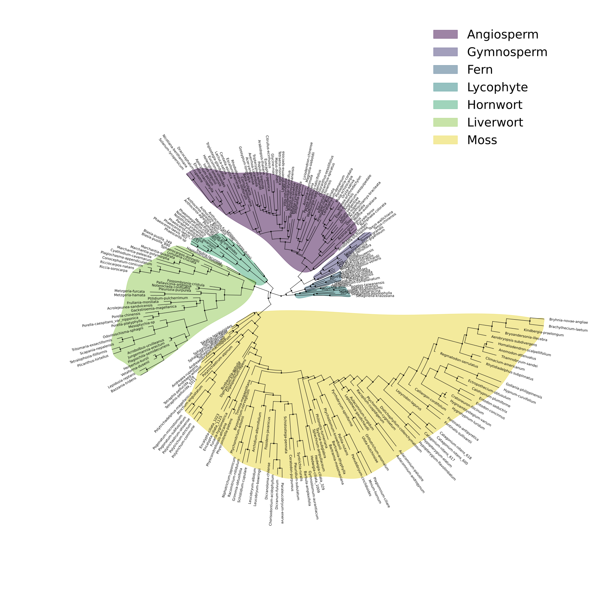

The shape of the highlight can be changed to be less smooth or just as a simple Convex Hull. For the former, simply change the parameter ``convexsmoothness`` to be, say 100 or 50. For the latter, we need to set the ``convexsmoothness`` as ``None``, with the example code as below.

>>> from evotree.basicdraw import plottree
>>> from matplotlib.pyplot import cm
>>> import numpy as np
>>> from Bio import Phylo
>>> Tree = Phylo.read("Example_243.tree",'newick')
>>> for tip in Tree.get_terminals():
>>>     if tip.name.endswith(".cds"):
>>>             tip.name = tip.name[:-4]
>>> TB,tree_object = plottree(treeobject=Tree)
>>> TB.fs =(24,24)
>>> TB.polardraw()
>>> colors = cm.viridis(np.linspace(0, 1, 7))
>>> TB.highlightcladepolar(clades=[('Amborella-trichopoda','Malus-doumeri'),('Gnetum-montanum','Taxus-wallichiana'),('Dipteris-shenzhenensis','Azolla-filiculoides'),('Huperzia-asiatica','Selaginella-moellendorffii'),('Leiosporoceros-dussii','Phaeoceros-laevis_902'),('Haplomitrium-mnioides','Herbertus-kurzii'),('Takakia-lepidozioides','Brachythecium-laetum')],facecolors=colors,alphas=[0.5]*7,rightoffset=0,topoffset=0,bottomoffset=0,labels=['Angiosperm','Gymnosperm','Fern','Lycophyte','Hornwort','Liverwort','Moss'],labelboxcolors=['black']*7,labelcolors=['white']*7,gradual=False,convexhull=True,saturations=[0.8]*7,convexsmoothness=None,convexalpha=None)
>>> TB.showlegend(frameon=False,fontsize=35)
>>> TB.saveplot('POLAR_NONULTRA_CONVEX_HULL.svg')                                                                                                           

Or using the command below:

.. code-block:: console

      (ENV)$ python Example_Code/polar_nonultra_convex_hull.py

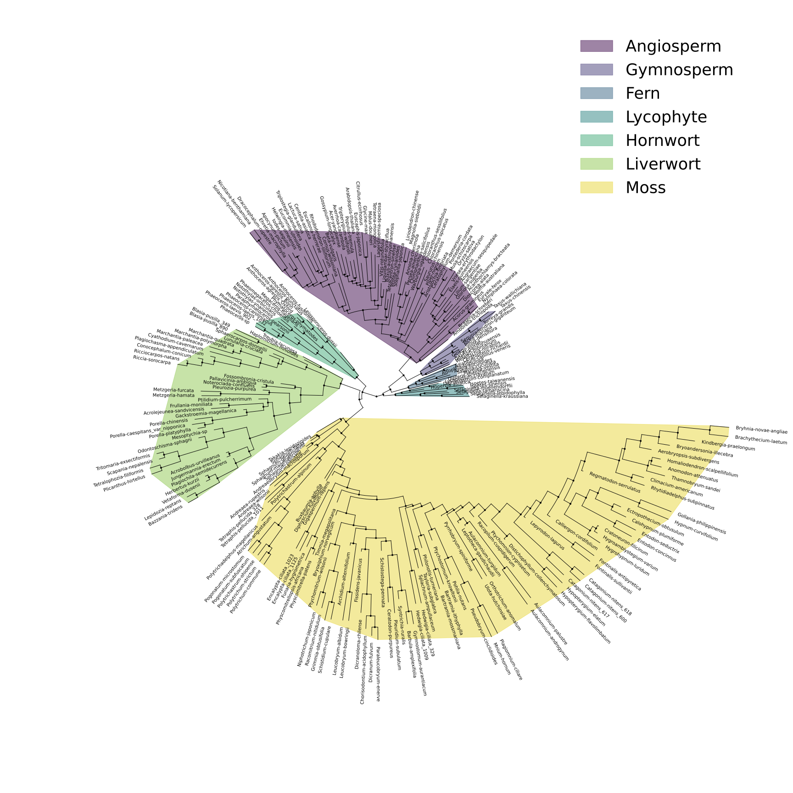

The ``alpha shape`` can also be specified using the parameter ``convexalpha``. We show below an example of setting ``convexalpha`` as 1.

>>> from evotree.basicdraw import plottree
>>> from matplotlib.pyplot import cm
>>> import numpy as np
>>> from Bio import Phylo
>>> Tree = Phylo.read("Example_243.tree",'newick')
>>> for tip in Tree.get_terminals():
>>>     if tip.name.endswith(".cds"):
>>>             tip.name = tip.name[:-4]
>>> TB,tree_object = plottree(treeobject=Tree)
>>> TB.fs =(24,24)
>>> TB.polardraw()
>>> colors = cm.viridis(np.linspace(0, 1, 7))
>>> TB.highlightcladepolar(clades=[('Amborella-trichopoda','Malus-doumeri'),('Gnetum-montanum','Taxus-wallichiana'),('Dipteris-shenzhenensis','Azolla-filiculoides'),('Huperzia-asiatica','Selaginella-moellendorffii'),('Leiosporoceros-dussii','Phaeoceros-laevis_902'),('Haplomitrium-mnioides','Herbertus-kurzii'),('Takakia-lepidozioides','Brachythecium-laetum')],facecolors=colors,alphas=[0.5]*7,rightoffset=0,topoffset=0,bottomoffset=0,labels=['Angiosperm','Gymnosperm','Fern','Lycophyte','Hornwort','Liverwort','Moss'],labelboxcolors=['black']*7,labelcolors=['white']*7,gradual=False,convexhull=True,saturations=[0.8]*7,convexsmoothness=None,convexalpha=1)
>>> TB.showlegend(frameon=False,fontsize=35)
>>> TB.saveplot('POLAR_NONULTRA_ALPHA_SHAPE.svg')

Or using the command below:

.. code-block:: console

      (ENV)$ python Example_Code/polar_nonultra_alpha_shape.py

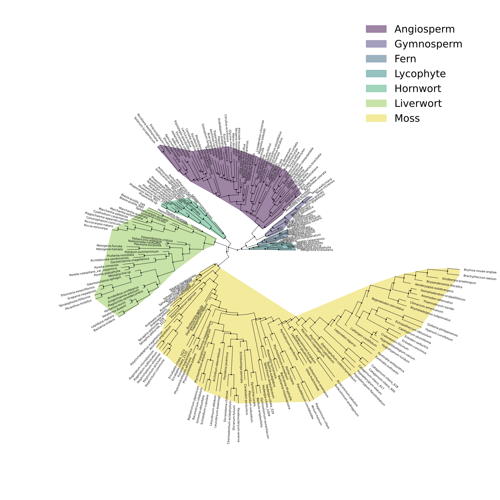

.. note::

       Small alpha (e.g. 0.1) will lead to tighter and more detailed shape (may break into pieces). Medium alpha (e.g. 1) can balance between detail and generality. Large alpha (e.g. 100) will approach convex hull.

.. _pbmm:

PBMM
----

We can infer the MLE of ancestral trait values for each internal node given a phylogenetic tree and a set of continuous trait data, using the command below:

>>> from evotree.simulatepbmm import PBMMBuilder
>>> PBMM = PBMMBuilder(tree='Fern.newick',trait='Fern_Data.tsv',traitcolname='Average DNA amount per chromosome (Mb)',traitname='Average chromosome size')
>>> PBMM.ancestry_infer_constantpbmm()
>>> TB = PBMM.drawalltrait_constant(topologylw=3,nodetextdecimal=2,traitdecimal=2)
>>> TB.drawscale(plotfulllengthscale=True,fullscaletickheight=0.1,fullscaleticklabeloffset=0.1,addgeo=True,geoscaling=100,fullscalexticks=[int(i*100) for i in range(5)])
>>> TB.saveplot("Ancestral_Trait_Reconstruction.svg")

.. image:: Example_Data/Ancestral_Trait_Reconstruction.svg

Or using the command below:

.. code-block:: console

      (ENV)$ python Example_Code/constant_pbmm.py

.. note::
        We refer users to the :doc:`model` section for detailed model structure under the hood.

The assumption of constant rates across lineages is barely valid in real-world data, we thus employ a variable-rate PBMM, using the command below:

>>> from evotree.simulatepbmm import PBMMBuilder
>>> PBMM = PBMMBuilder(tree='Fern.newick',trait='Fern_Data.tsv',traitcolname='Average DNA amount per chromosome (Mb)',traitname='Average chromosome size')
>>> PBMM.exportnodetips(output="Tree_info.tsv")
>>> PBMM.ancestry_infer_variablepbmm(num_warmup=200,num_samples=200,posteriorsamplesoutput="Posterior_Samples.tsv",bayesstatsoutput="Posterior_Samples_Stats.tsv")
>>> TB = PBMM.drawalltrait_variable(topologylw=3,nodetextdecimal=2,traitdecimal=2)
>>> TB.drawscale(plotfulllengthscale=True,fullscaletickheight=0.1,fullscaleticklabeloffset=0.1,addgeo=True,geoscaling=100,fullscalexticks=[int(i*100) for i in range(5)])
>>> TB.saveplot("Variable_Ancestral_Trait_Reconstruction.svg")

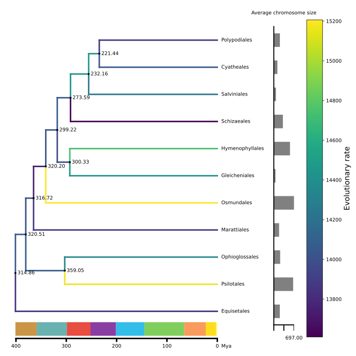

Or using the command below:

.. code-block:: console

      (ENV)$ python Example_Code/variable_pbmm.py

The posterior samples and their statistics (e.g., **CI** and **ESS**) can be traced in the corresponding ``*.tsv`` files. We can use the ``ploter`` module to trace the posterior samples:

>>> from evotree.ploter import Tracer
>>> Tracer_oj = Tracer(data="Posterior_Samples.tsv",usedata=["Polypodiales_sigma2","Cyatheales_sigma2"],n_row=1,n_col=2,n_chains=2,fs=(14,6))
>>> Tracer_oj.basic_draw()
>>> Tracer_oj.saveplot(output="Trace_Posterior_Samples.svg")

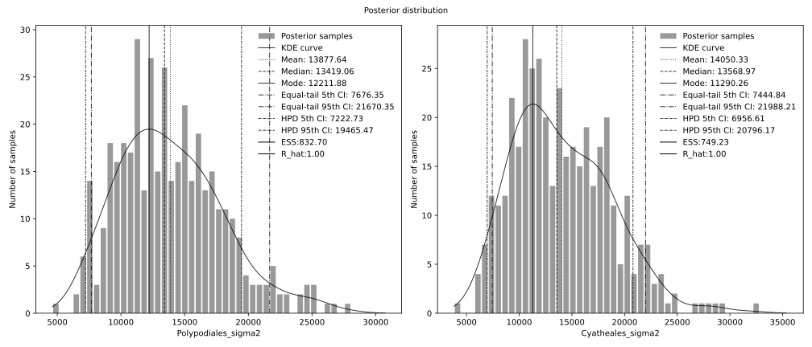

Or using the command below:

.. code-block:: console

      (ENV)$ python Example_Code/trace_samples.py

To determine whether two branches have significantly different rates, we can calculate the Bayes Factor (BF) using the Savage-Dickey density ratio, using the command below:

>>> from evotree.simulatepbmm import PBMMBuilder,savage_dickey_density_ratio,writebf
>>> PBMM = PBMMBuilder(tree='Fern.newick',trait='Fern_Data.tsv',traitcolname='Average DNA amount per chromosome (Mb)',traitname='Average chromosome size')
>>> PBMM.calculate_ini_parameters()
>>> pairs_to_compare = ["Equisetales_sigma2","Psilotales_sigma2","Ophioglossales_sigma2","Marattiales_sigma2"]
>>> BF_Pair = savage_dickey_density_ratio(PBMM,sample="Posterior_Samples.tsv",compared_parameters=pairs_to_compare,lognormal=True)
>>> writebf(BF_Pair,output="BF.tsv")

Or using the command below:

.. code-block:: console

      (ENV)$ python Example_Code/bf.py

We get the following results:

.. csv-table:: Bayes Factor
        :file: Example_Data/BF.csv
        :header-rows: 1
        :delim: ,

We get some BF which were within (1/3,1) or (1,3), suggesting inconclusive evidence for the rate difference nor the indifference.

We can calculate the phylogenetic signal represented by Pagel's :math:`\lambda` for each trait, using the command below:

>>> evotree.simulatepbmm import PBMMBuilder
>>> import pandas as pd
>>> df = pd.read_csv("Fern_Data.tsv",header=0,index_col=0,sep='\t')
>>> all_trait_names = df.columns
>>> for trait_name in all_trait_names:
>>>     PBMM = PBMMBuilder(tree='Fern.newick',trait='Fern_Data.tsv',traitcolname=trait_name,traitname=trait_name)
>>>     PBMM.pagel_lambda()

Or using the command below:

.. code-block:: console

      (ENV)$ python Example_Code/pagel_lambda.py

We get the following results:

:1: Pagel's :math:`\lambda` 5.9608609865491405e-06 for Species richness (P-value: 1.00000)
:2: Pagel's :math:`\lambda` 0.5540043919832507 for Holoploid genome size 1C (Mb) (P-value: 0.00000)
:3: Pagel's :math:`\lambda` 0.4861442493345799 for Monoploid genome size 1Cx (Mb) (P-value: 0.00000)
:4: Pagel's :math:`\lambda` 5.9608609865491405e-06 for Average DNA amount per chromosome (Mb) (P-value: 1.00000)
:5: Pagel's :math:`\lambda` 0.3626291444231002 for Minimum  holoploid genome size (Mb) (P-value: 0.00000)
:6: Pagel's :math:`\lambda` 0.4800180909151914 for Maximum holoploid genome size (Mb) (P-value: 0.00000)

We can see that the traits pertaining to (Minimum or Maximum) Holoploid genome size and Monoploid genome size are subject to a significant phylogenetic signal.
