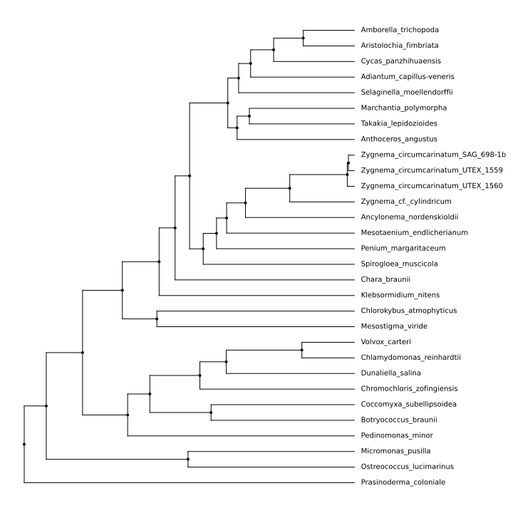
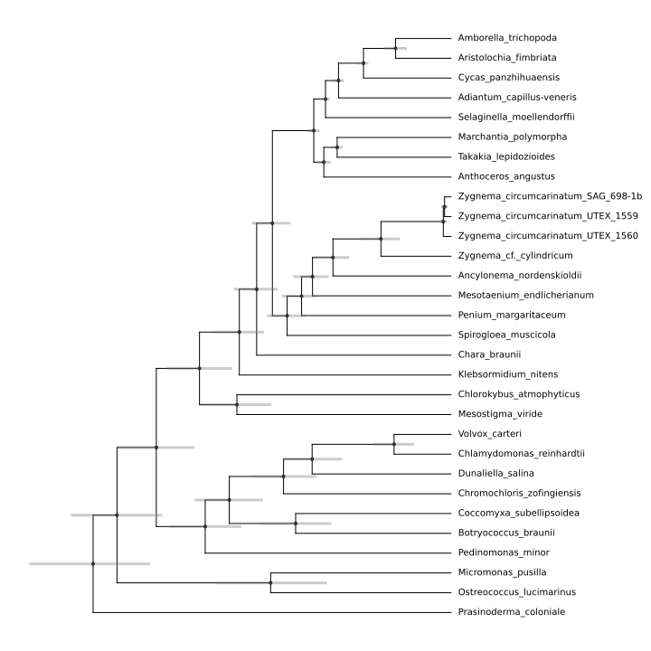
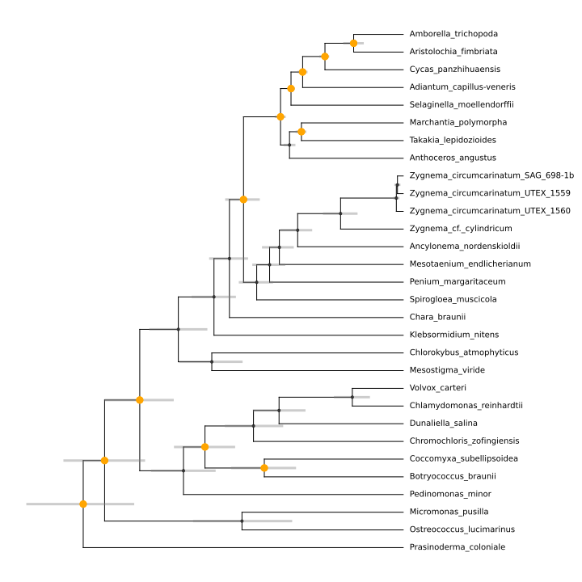
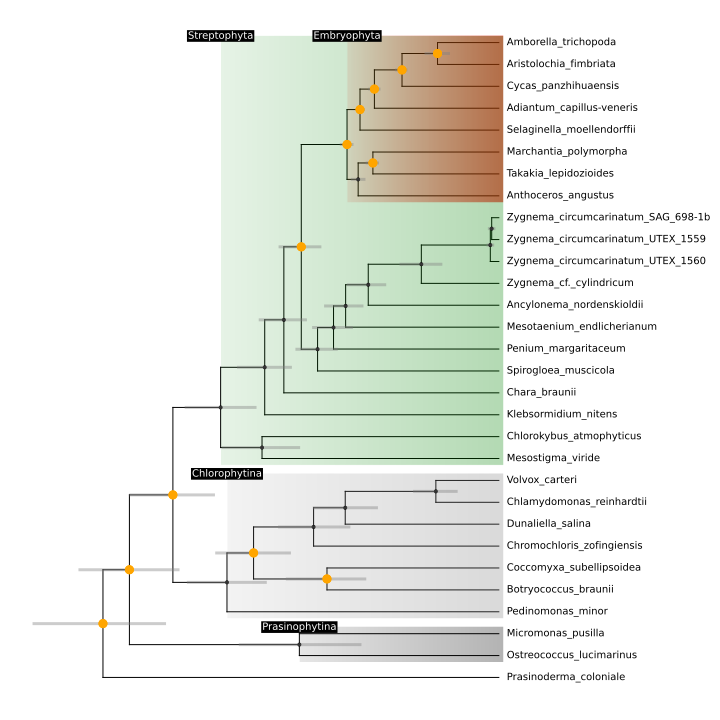
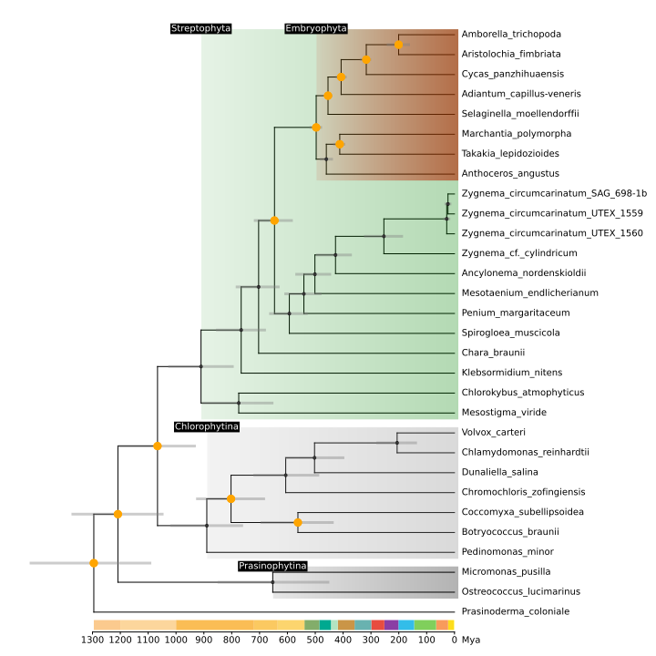
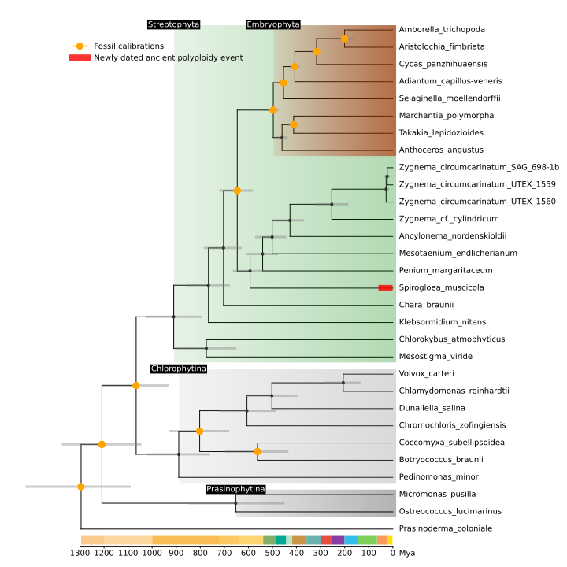
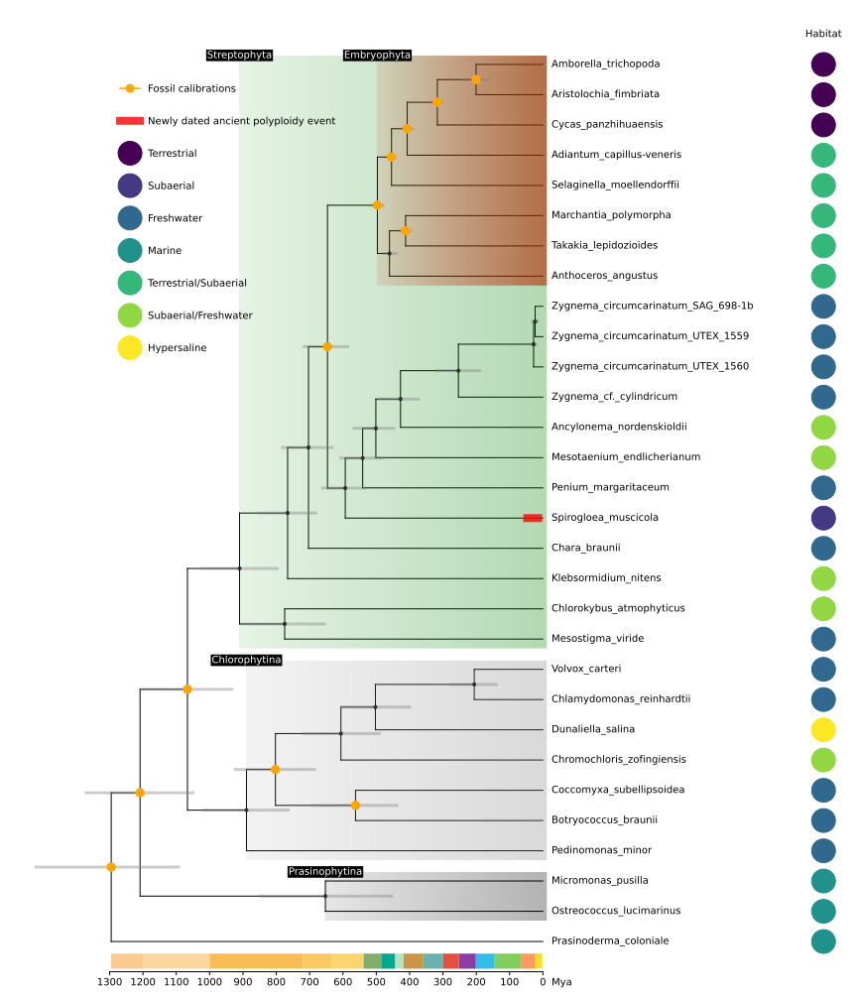
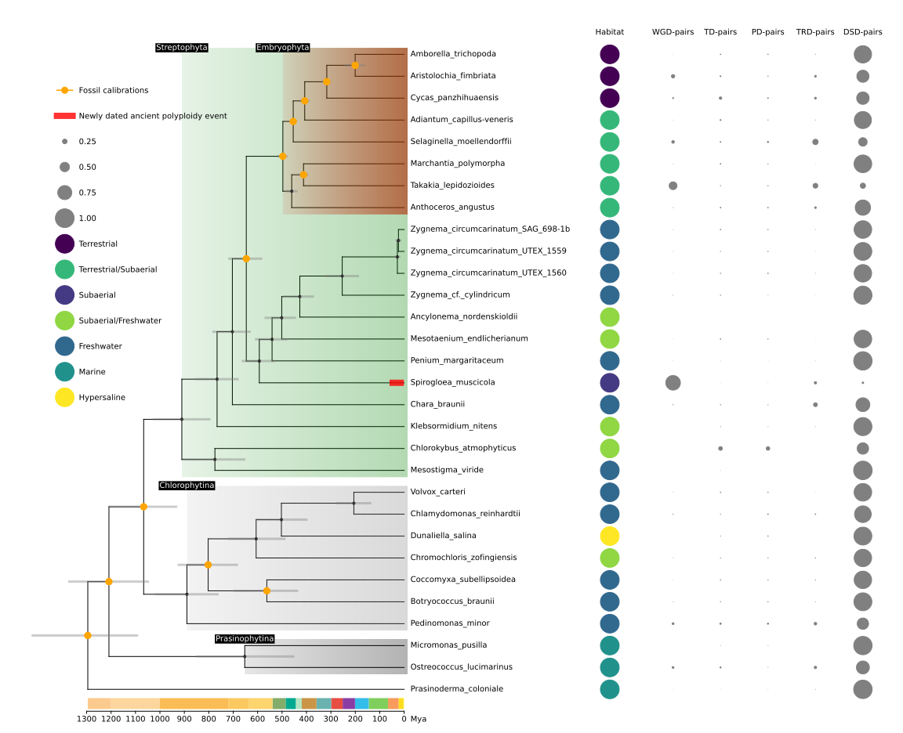
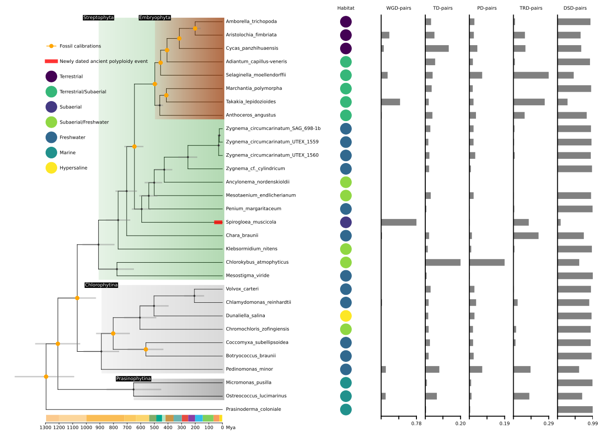
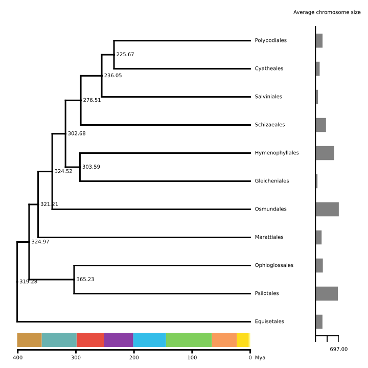

Usage
=====

.. _plottree:

Plottree
--------

Let's draw a simple phylogenetic tree using the command below:

>>> from evotree.basicdraw import plottree
>>> TB,tree_object = plottree(tree="FigTree_newick")
>>> TB.basicdraw()
>>> TB.saveplot('Baisc_Tree.svg')

Users can also write the above code into a ``*.py`` file and plot the tree using the command below:

.. code-block:: console

      (ENV)$ python Example_Code/basic_tree.py

.. note::

       All the example codes can be found in `Example_Code <https://github.com/heche-psb/evotree-docs/tree/main/docs/source/Example_Code>`_ and the example data in `Example_Data <https://github.com/heche-psb/evotree-docs/tree/main/docs/source/Example_Data>`_.

Now, let's add **uncertainty bands** to each internal nodes using the command below:

>>> from evotree.basicdraw import plottree
>>> TB,tree_object = plottree(tree="FigTree_newick")
>>> TB.plotnodeuncertainty = True
>>> TB.nulw = 3
>>> TB.nuccolor = 'gray'
>>> TB.basicdraw()
>>> TB.saveplot('With_Uncertainty.svg')

Or using the command below:

.. code-block:: console

      (ENV)$ python Example_Code/with_uncertainty.py

We can also add the **fossil calibrations** that we used using the command below:

>>> from evotree.basicdraw import plottree
>>> TB,tree_object = plottree(tree="FigTree_newick")
>>> TB.plotnodeuncertainty = True
>>> TB.nulw = 3
>>> TB.nuccolor = 'gray'
>>> TB.basicdraw()
>>> fossilnodes=[('Prasinoderma_coloniale','Amborella_trichopoda'),('Ostreococcus_lucimarinus','Pedinomonas_minor'),('Pedinomonas_minor','Mesostigma_viride'),('Botryococcus_braunii','Volvox_carteri'),('Botryococcus_braunii','Coccomyxa_subellipsoidea'),('Spirogloea_muscicola','Amborella_trichopoda'),('Anthoceros_angustus','Amborella_trichopoda'),('Takakia_lepidozioides','Marchantia_polymorpha'),('Selaginella_moellendorffii','Amborella_trichopoda'),('Adiantum_capillus-veneris','Amborella_trichopoda'),('Cycas_panzhihuaensis','Amborella_trichopoda'),('Aristolochia_fimbriata','Amborella_trichopoda')]
>>> TB.highlightnode(nodes=fossilnodes,colors=['orange' for i in fossilnodes],nodesizes=[8 for i in fossilnodes],addlegend=True,legendlabel="Fossil calibrations")
>>> TB.saveplot('With_Fossil.svg')

Or using the command below:

.. code-block:: console

      (ENV)$ python Example_Code/with_fossil.py

We can further **highlight specific clades** using the command below:

>>> from evotree.basicdraw import plottree
>>> TB,tree_object = plottree(tree="FigTree_newick")
>>> TB.plotnodeuncertainty = True
>>> TB.nulw = 3
>>> TB.nuccolor = 'gray'
>>> TB.basicdraw()
>>> fossilnodes=[('Prasinoderma_coloniale','Amborella_trichopoda'),('Ostreococcus_lucimarinus','Pedinomonas_minor'),('Pedinomonas_minor','Mesostigma_viride'),('Botryococcus_braunii','Volvox_carteri'),('Botryococcus_braunii','Coccomyxa_subellipsoidea'),('Spirogloea_muscicola','Amborella_trichopoda'),('Anthoceros_angustus','Amborella_trichopoda'),('Takakia_lepidozioides','Marchantia_polymorpha'),('Selaginella_moellendorffii','Amborella_trichopoda'),('Adiantum_capillus-veneris','Amborella_trichopoda'),('Cycas_panzhihuaensis','Amborella_trichopoda'),('Aristolochia_fimbriata','Amborella_trichopoda')]
>>> TB.highlightnode(nodes=fossilnodes,colors=['orange' for i in fossilnodes],nodesizes=[8 for i in fossilnodes],addlegend=True,legendlabel="Fossil calibrations")
>>> TB.highlightclade(clades=[('Amborella_trichopoda','Anthoceros_angustus'),('Zygnema_circumcarinatum_SAG_698-1b','Mesostigma_viride')],facecolors=['red','green'],gradual=True,alphas=[0.6,0.3],rightoffset=0.01,topoffset=0.02,bottomoffset=-0.01,labels=['Embryophyta','Streptophyta'],labelboxcolors=['black','black'],labelcolors=['white','white'])
>>> TB.highlightclade(clades=[('Volvox_carteri','Pedinomonas_minor'),('Micromonas_pusilla','Ostreococcus_lucimarinus')],facecolors=['gray','black'],gradual=True,alphas=[0.3,0.3],rightoffset=0.01,topoffset=0.02,bottomoffset=-0.01,labels=['Chlorophytina','Prasinophytina'],labelboxcolors=['black','black'],labelcolors=['white','white'])
>>> TB.saveplot('Highlight_Clade.svg')

Or using the command below:

.. code-block:: console

      (ENV)$ python Example_Code/highlight_clade.py

Adding a **time-scale** can be achieved using the command below:

>>> from evotree.basicdraw import plottree
>>> TB,tree_object = plottree(tree="FigTree_newick")
>>> TB.plotnodeuncertainty = True
>>> TB.nulw = 3
>>> TB.nuccolor = 'gray'
>>> TB.basicdraw()
>>> fossilnodes=[('Prasinoderma_coloniale','Amborella_trichopoda'),('Ostreococcus_lucimarinus','Pedinomonas_minor'),('Pedinomonas_minor','Mesostigma_viride'),('Botryococcus_braunii','Volvox_carteri'),('Botryococcus_braunii','Coccomyxa_subellipsoidea'),('Spirogloea_muscicola','Amborella_trichopoda'),('Anthoceros_angustus','Amborella_trichopoda'),('Takakia_lepidozioides','Marchantia_polymorpha'),('Selaginella_moellendorffii','Amborella_trichopoda'),('Adiantum_capillus-veneris','Amborella_trichopoda'),('Cycas_panzhihuaensis','Amborella_trichopoda'),('Aristolochia_fimbriata','Amborella_trichopoda')]
>>> TB.highlightnode(nodes=fossilnodes,colors=['orange' for i in fossilnodes],nodesizes=[8 for i in fossilnodes],addlegend=True,legendlabel="Fossil calibrations")
>>> TB.highlightclade(clades=[('Amborella_trichopoda','Anthoceros_angustus'),('Zygnema_circumcarinatum_SAG_698-1b','Mesostigma_viride')],facecolors=['red','green'],gradual=True,alphas=[0.6,0.3],rightoffset=0.01,topoffset=0.02,bottomoffset=-0.01,labels=['Embryophyta','Streptophyta'],labelboxcolors=['black','black'],labelcolors=['white','white'])
>>> TB.highlightclade(clades=[('Volvox_carteri','Pedinomonas_minor'),('Micromonas_pusilla','Ostreococcus_lucimarinus')],facecolors=['gray','black'],gradual=True,alphas=[0.3,0.3],rightoffset=0.01,topoffset=0.02,bottomoffset=-0.01,labels=['Chlorophytina','Prasinophytina'],labelboxcolors=['black','black'],labelcolors=['white','white'])
>>> TB.drawscale(plotfulllengthscale=True,fullscaletickheight=0.1,fullscaleticklabeloffset=0.1,addgeo=True,geoscaling=100,fullscalexticks=[int(i*100) for i in range(14)])
>>> TB.saveplot('Add_TimeScale.svg')

Or using the command below:

.. code-block:: console

      (ENV)$ python Example_Code/add_timescale.py

Here we have inferred the WGD date of `Spirogloea muscicola`, we can **add this WGD** and **show legend** using the command below:

>>> from evotree.basicdraw import plottree
>>> TB,tree_object = plottree(tree="FigTree_newick")
>>> TB.plotnodeuncertainty = True
>>> TB.nulw = 3
>>> TB.nuccolor = 'gray'
>>> TB.basicdraw()
>>> fossilnodes=[('Prasinoderma_coloniale','Amborella_trichopoda'),('Ostreococcus_lucimarinus','Pedinomonas_minor'),('Pedinomonas_minor','Mesostigma_viride'),('Botryococcus_braunii','Volvox_carteri'),('Botryococcus_braunii','Coccomyxa_subellipsoidea'),('Spirogloea_muscicola','Amborella_trichopoda'),('Anthoceros_angustus','Amborella_trichopoda'),('Takakia_lepidozioides','Marchantia_polymorpha'),('Selaginella_moellendorffii','Amborella_trichopoda'),('Adiantum_capillus-veneris','Amborella_trichopoda'),('Cycas_panzhihuaensis','Amborella_trichopoda'),('Aristolochia_fimbriata','Amborella_trichopoda')]
>>> TB.highlightnode(nodes=fossilnodes,colors=['orange' for i in fossilnodes],nodesizes=[8 for i in fossilnodes],addlegend=True,legendlabel="Fossil calibrations")
>>> TB.highlightclade(clades=[('Amborella_trichopoda','Anthoceros_angustus'),('Zygnema_circumcarinatum_SAG_698-1b','Mesostigma_viride')],facecolors=['red','green'],gradual=True,alphas=[0.6,0.3],rightoffset=0.01,topoffset=0.02,bottomoffset=-0.01,labels=['Embryophyta','Streptophyta'],labelboxcolors=['black','black'],labelcolors=['white','white'])
>>> TB.highlightclade(clades=[('Volvox_carteri','Pedinomonas_minor'),('Micromonas_pusilla','Ostreococcus_lucimarinus')],facecolors=['gray','black'],gradual=True,alphas=[0.3,0.3],rightoffset=0.01,topoffset=0.02,bottomoffset=-0.01,labels=['Chlorophytina','Prasinophytina'],labelboxcolors=['black','black'],labelcolors=['white','white'])
>>> TB.drawscale(plotfulllengthscale=True,fullscaletickheight=0.1,fullscaleticklabeloffset=0.1,addgeo=True,geoscaling=100,fullscalexticks=[int(i*100) for i in range(14)])
>>> TB.drawwgd(wgd="Spi_WGD.tsv",addlegend=True,legendlabel="Newly dated ancient polyploidy event",lw=8,al=0.8)
>>> TB.showlegend(frameon=False,bbox_to_anchor=(0.60, 0.95))
>>> TB.saveplot('Add_WGD.svg')

Or using the command below:

.. code-block:: console

      (ENV)$ python Example_Code/add_wgd.py

Now let's **add habitat type** data to the tree using the command below:

>>> from evotree.basicdraw import plottree
>>> from matplotlib.pyplot import cm
>>> import numpy as np
>>> TB,tree_object = plottree(tree="FigTree_newick")
>>> TB.fs =(12,14)
>>> TB.plotnodeuncertainty = True
>>> TB.nulw = 3
>>> TB.nuccolor = 'gray'
>>> TB.basicdraw()
>>> fossilnodes=[('Prasinoderma_coloniale','Amborella_trichopoda'),('Ostreococcus_lucimarinus','Pedinomonas_minor'),('Pedinomonas_minor','Mesostigma_viride'),('Botryococcus_braunii','Volvox_carteri'),('Botryococcus_braunii','Coccomyxa_subellipsoidea'),('Spirogloea_muscicola','Amborella_trichopoda'),('Anthoceros_angustus','Amborella_trichopoda'),('Takakia_lepidozioides','Marchantia_polymorpha'),('Selaginella_moellendorffii','Amborella_trichopoda'),('Adiantum_capillus-veneris','Amborella_trichopoda'),('Cycas_panzhihuaensis','Amborella_trichopoda'),('Aristolochia_fimbriata','Amborella_trichopoda')]
>>> TB.highlightnode(nodes=fossilnodes,colors=['orange' for i in fossilnodes],nodesizes=[8 for i in fossilnodes],addlegend=True,legendlabel="Fossil calibrations")
>>> TB.highlightclade(clades=[('Amborella_trichopoda','Anthoceros_angustus'),('Zygnema_circumcarinatum_SAG_698-1b','Mesostigma_viride')],facecolors=['red','green'],gradual=True,alphas=[0.6,0.3],rightoffset=0.01,topoffset=0.02,bottomoffset=-0.01,labels=['Embryophyta','Streptophyta'],labelboxcolors=['black','black'],labelcolors=['white','white'])
>>> TB.highlightclade(clades=[('Volvox_carteri','Pedinomonas_minor'),('Micromonas_pusilla','Ostreococcus_lucimarinus')],facecolors=['gray','black'],gradual=True,alphas=[0.3,0.3],rightoffset=0.01,topoffset=0.02,bottomoffset=-0.01,labels=['Chlorophytina','Prasinophytina'],labelboxcolors=['black','black'],labelcolors=['white','white'])
>>> TB.drawscale(plotfulllengthscale=True,fullscaletickheight=0.1,fullscaleticklabeloffset=0.1,addgeo=True,geoscaling=100,fullscalexticks=[int(i*100) for i in range(14)])
>>> TB.drawwgd(wgd="Spi_WGD.tsv",addlegend=True,legendlabel="Newly dated ancient polyploidy event",lw=8,al=0.8)
>>> inixoffset = 0.60
>>> colors = cm.viridis(np.linspace(0, 1, 7))
>>> colormap = {i:colors[i] for i in range(7)}
>>> Map_Habitat = {0:"Terrestrial",1:"Subaerial",2:"Freshwater",3:"Marine",4:"Terrestrial/Subaerial",5:"Subaerial/Freshwater",6:"Hypersaline"}
>>> TB.drawcircles(traittype="Habitat.tsv",xoffset=inixoffset,usetypedata=["Habitat"],traitobjectname="Habitat",scalingx=0.1,maxcirclesize=24,colormap=colormap,legendmap=Map_Habitat)
>>> TB.showlegend(frameon=False,bbox_to_anchor=(0.40, 0.65),labelspacing=2.3)
>>> TB.saveplot('Add_Habitat.svg')

Or using the command below:

.. code-block:: console

      (ENV)$ python Example_Code/add_habitat.py

We can plot **gene duplication** data to the tree while **specify the order of legends** using the command below:

>>> from evotree.basicdraw import plottree
>>> from matplotlib.pyplot import cm
>>> import numpy as np
>>> TB,tree_object = plottree(tree="FigTree_newick")
>>> TB.fs = (16,13)
>>> TB.plotnodeuncertainty = True
>>> TB.nulw = 3
>>> TB.nuccolor = 'gray'
>>> TB.basicdraw()
>>> fossilnodes=[('Prasinoderma_coloniale','Amborella_trichopoda'),('Ostreococcus_lucimarinus','Pedinomonas_minor'),('Pedinomonas_minor','Mesostigma_viride'),('Botryococcus_braunii','Volvox_carteri'),('Botryococcus_braunii','Coccomyxa_subellipsoidea'),('Spirogloea_muscicola','Amborella_trichopoda'),('Anthoceros_angustus','Amborella_trichopoda'),('Takakia_lepidozioides','Marchantia_polymorpha'),('Selaginella_moellendorffii','Amborella_trichopoda'),('Adiantum_capillus-veneris','Amborella_trichopoda'),('Cycas_panzhihuaensis','Amborella_trichopoda'),('Aristolochia_fimbriata','Amborella_trichopoda')]
>>> TB.highlightnode(nodes=fossilnodes,colors=['orange' for i in fossilnodes],nodesizes=[8 for i in fossilnodes],addlegend=True,legendlabel="Fossil calibrations")
>>> TB.highlightclade(clades=[('Amborella_trichopoda','Anthoceros_angustus'),('Zygnema_circumcarinatum_SAG_698-1b','Mesostigma_viride')],facecolors=['red','green'],gradual=True,alphas=[0.6,0.3],rightoffset=0.01,topoffset=0.02,bottomoffset=-0.01,labels=['Embryophyta','Streptophyta'],labelboxcolors=['black','black'],labelcolors=['white','white'])
>>> TB.highlightclade(clades=[('Volvox_carteri','Pedinomonas_minor'),('Micromonas_pusilla','Ostreococcus_lucimarinus')],facecolors=['gray','black'],gradual=True,alphas=[0.3,0.3],rightoffset=0.01,topoffset=0.02,bottomoffset=-0.01,labels=['Chlorophytina','Prasinophytina'],labelboxcolors=['black','black'],labelcolors=['white','white'])
>>> TB.drawscale(plotfulllengthscale=True,fullscaletickheight=0.1,fullscaleticklabeloffset=0.1,addgeo=True,geoscaling=100,fullscalexticks=[int(i*100) for i in range(14)])
>>> TB.drawwgd(wgd="Spi_WGD.tsv",addlegend=True,legendlabel="Newly dated ancient polyploidy event",lw=8,al=0.8)
>>> inixoffset = 0.60
>>> colors = cm.viridis(np.linspace(0, 1, 7))
>>> colormap = {i:colors[i] for i in range(7)}
>>> Map_Habitat = {0:"Terrestrial",1:"Subaerial",2:"Freshwater",3:"Marine",4:"Terrestrial/Subaerial",5:"Subaerial/Freshwater",6:"Hypersaline"}
>>> TB.drawcircles(traittype="Habitat.tsv",xoffset=inixoffset,usetypedata=["Habitat"],traitobjectname="Habitat",scalingx=0.1,maxcirclesize=24,colormap=colormap,legendmap=Map_Habitat)
>>> stepxoffset = 0.15
>>> cols = ["WGD-pairs-percentage","TD-pairs-percentage","PD-pairs-percentage","TRD-pairs-percentage","DSD-pairs-percentage"]
>>> for ind,col in enumerate(cols):
>>>     quantitylegendflag = True if ind == 0 else False
>>>     TB.drawcircles(traitquantity='dupfinder.info.percentage.tsv',usequantitydata=[col],xoffset=inixoffset+stepxoffset*(ind+1),traitobjectname="{}".format(col.replace("-percentage","")),scalingx=0.2,maxcirclesize=24,quantitylegend=quantitylegendflag,maxvaluescaler=1,decimal=2)
>>> handles, labels = TB.ax.get_legend_handles_labels()
>>> order_dic = {'Terrestrial':1,'Terrestrial/Subaerial':2,'Subaerial':3,'Subaerial/Freshwater':4,'Freshwater':5,'Marine':6,'Hypersaline':7}
>>> labels, handles = zip(r*sorted(zip(labels, handles), key=lambda x: order_dic.get(x[0],0)))
>>> TB.showlegend(handles,labels,frameon=False,bbox_to_anchor=(0.25, 0.45),labelspacing=2.3)
>>> TB.saveplot('Add_GD.svg')

Or using the command below:

.. code-block:: console

      (ENV)$ python Example_Code/add_gd.py

We can also show the gene duplication data as **bar plots** using the command below:

>>> from evotree.basicdraw import plottree
>>> from matplotlib.pyplot import cm
>>> import numpy as np
>>> TB,tree_object = plottree(tree="FigTree_newick")
>>> TB.fs = (18,13)
>>> TB.plotnodeuncertainty = True
>>> TB.nulw = 3
>>> TB.nuccolor = 'gray'
>>> TB.basicdraw()
>>> fossilnodes=[('Prasinoderma_coloniale','Amborella_trichopoda'),('Ostreococcus_lucimarinus','Pedinomonas_minor'),('Pedinomonas_minor','Mesostigma_viride'),('Botryococcus_braunii','Volvox_carteri'),('Botryococcus_braunii','Coccomyxa_subellipsoidea'),('Spirogloea_muscicola','Amborella_trichopoda'),('Anthoceros_angustus','Amborella_trichopoda'),('Takakia_lepidozioides','Marchantia_polymorpha'),('Selaginella_moellendorffii','Amborella_trichopoda'),('Adiantum_capillus-veneris','Amborella_trichopoda'),('Cycas_panzhihuaensis','Amborella_trichopoda'),('Aristolochia_fimbriata','Amborella_trichopoda')]
>>> TB.highlightnode(nodes=fossilnodes,colors=['orange' for i in fossilnodes],nodesizes=[8 for i in fossilnodes],addlegend=True,legendlabel="Fossil calibrations")
>>> TB.highlightclade(clades=[('Amborella_trichopoda','Anthoceros_angustus'),('Zygnema_circumcarinatum_SAG_698-1b','Mesostigma_viride')],facecolors=['red','green'],gradual=True,alphas=[0.6,0.3],rightoffset=0.01,topoffset=0.02,bottomoffset=-0.01,labels=['Embryophyta','Streptophyta'],labelboxcolors=['black','black'],labelcolors=['white','white'])
>>> TB.highlightclade(clades=[('Volvox_carteri','Pedinomonas_minor'),('Micromonas_pusilla','Ostreococcus_lucimarinus')],facecolors=['gray','black'],gradual=True,alphas=[0.3,0.3],rightoffset=0.01,topoffset=0.02,bottomoffset=-0.01,labels=['Chlorophytina','Prasinophytina'],labelboxcolors=['black','black'],labelcolors=['white','white'])
>>> TB.drawscale(plotfulllengthscale=True,fullscaletickheight=0.1,fullscaleticklabeloffset=0.1,addgeo=True,geoscaling=100,fullscalexticks=[int(i*100) for i in range(14)])
>>> TB.drawwgd(wgd="Spi_WGD.tsv",addlegend=True,legendlabel="Newly dated ancient polyploidy event",lw=8,al=0.8)
>>> inixoffset = 0.65
>>> colors = cm.viridis(np.linspace(0, 1, 7))
>>> colormap = {i:colors[i] for i in range(7)}
>>> Map_Habitat = {0:"Terrestrial",1:"Subaerial",2:"Freshwater",3:"Marine",4:"Terrestrial/Subaerial",5:"Subaerial/Freshwater",6:"Hypersaline"}
>>> TB.drawcircles(traittype="Habitat.tsv",xoffset=inixoffset,usetypedata=["Habitat"],traitobjectname="Habitat",scalingx=0.1,maxcirclesize=24,colormap=colormap,legendmap=Map_Habitat)
>>> stepxoffset = 0.25
>>> cols = ["WGD-pairs-percentage","TD-pairs-percentage","PD-pairs-percentage","TRD-pairs-percentage","DSD-pairs-percentage"]
>>> for ind,col in enumerate(cols):
>>>     TB.drawtrait(trait=["dupfinder.info.percentage.tsv"],usedata=[col],xoffset=inixoffset+stepxoffset*(ind+1),traitobjectname="{}".format(col.replace("-percentage","")),scalingx=0.2,traitcolor='gray',decimal=2)
>>> handles, labels = TB.ax.get_legend_handles_labels()
>>> order_dic = {'Terrestrial':1,'Terrestrial/Subaerial':2,'Subaerial':3,'Subaerial/Freshwater':4,'Freshwater':5,'Marine':6,'Hypersaline':7}
>>> labels, handles = zip(r*sorted(zip(labels, handles), key=lambda x: order_dic.get(x[0],0)))
>>> TB.showlegend(handles,labels,frameon=False,bbox_to_anchor=(0.25, 0.60),labelspacing=2.3)
>>> TB.saveplot('GD_Bar.svg')

Or using the command below:

.. code-block:: console

      (ENV)$ python Example_Code/gd_bar.py

.. _pbmm:

PBMM
----

We can infer the MLE of ancestral trait values for each internal node given a phylogenetic tree and a continuous trait data, using the command below:

>>> from evotree.simulatepbmm import PBMMBuilder
>>> PBMM = PBMMBuilder(tree='Fern.newick',trait='Fern_Data.tsv',traitcolname='Average DNA amount per chromosome (Mb)',traitname='Average chromosome size')
>>> PBMM.ancestry_infer_constantpbmm()
>>> TB = PBMM.drawalltrait_constant(topologylw=3,nodetextdecimal=2,traitdecimal=2)
>>> TB.drawscale(plotfulllengthscale=True,fullscaletickheight=0.1,fullscaleticklabeloffset=0.1,addgeo=True,geoscaling=100,fullscalexticks=[int(i*100) for i in range(5)])
>>> TB.saveplot("Ancestral_Trait_Reconstruction.svg")

Or using the command below:

.. code-block:: console

      (ENV)$ python Example_Code/constant_pbmm.py

